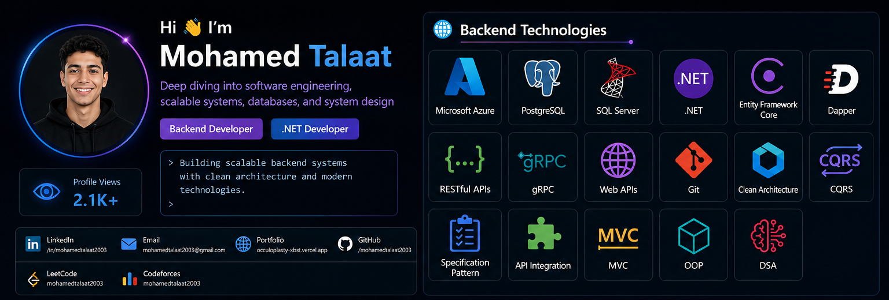

 

<table width="100%">
<tr>
<td width="33%" align="center">

</td>
<td width="33%" align="center">

</td>
<td width="33%" align="center">

</td>
</tr>
</table>

 

<table width="100%">
<tr>
<td align="center">

<h3>🐍 Contribution Snake</h3>

<picture>
<source media="(prefers-color-scheme: dark)" srcset="https://raw.githubusercontent.com/mohamedtalaat2003/mohamedtalaat2003/output/github-contribution-grid-snake-dark.svg">
<source media="(prefers-color-scheme: light)" srcset="https://raw.githubusercontent.com/mohamedtalaat2003/mohamedtalaat2003/output/github-contribution-grid-snake.svg">

</picture>

 

💡 <b>Learn, Build, Deploy, Repeat.</b>

</td>
</tr>
</table>

